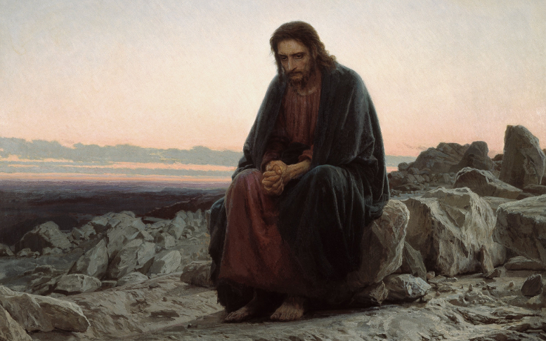

# Иисус Христос в пустыне.

  
[Христо́с в пусты́не. Художник Иван Крамской](https://ru.wikipedia.org/wiki/%D0%A5%D1%80%D0%B8%D1%81%D1%82%D0%BE%D1%81_%D0%B2_%D0%BF%D1%83%D1%81%D1%82%D1%8B%D0%BD%D0%B5_(%D0%BA%D0%B0%D1%80%D1%82%D0%B8%D0%BD%D0%B0_%D0%9A%D1%80%D0%B0%D0%BC%D1%81%D0%BA%D0%BE%D0%B3%D0%BE)  

## Фрагмент Евангелия от Матфея.

## Глава 3.

16. И, крестившись, Иисус тотчас вышел из воды, - и се, отверзлись Ему небеса, и увидел _Иоанн_ Духа Божия, Который сходил, как голубь, и ниспускался на Него.
17. И се, глас с небес глаголющий: Сей есть Сын Мой возлюбленный, в Котором Мое Благоволение.

## Глава 4.  

1. После  Иисус возведен был Духом в пустыню для искушения от диавола.
2. И постившись сорок дней и сорок ночей, напоследок взалкал.
3. И приступил к Нему искуситель и сказал: если Ты Сын Божий, скажи, чтобы камни сии сделались хлебами.
4. Он же сказал ему в ответ: не хлебом одним будет жить человек, но всяким словом, исходящим из уст Божих.
5. Потом берет Его диавол в святой город и поставляет Его на крыле храма,
6. И говорит Ему: если ты Сын Божий, бросься вниз, ибо написано: Ангелам Своим заповедает о Тебе, и на руках понесут Тебя, да не преткнешься о камень ногою Твоею.
7. Иисус сказал ему: написано также: не искушай Господа Бога твоего.
8. Опять берет Его диавол на весьма высокую гору и показывает Ему все царства мира и славу их.
9. И говорит Ему: всё это дам Тебе, если, пав, поклонишься мне.
10. Тогда Иисус говорит ему: отойди от меня сатана, ибо написано: Господу Богу твоему поклоняйся и Ему одному служи.
11. Тогда оствляет Его диавол, и се, Ангелы приступили и служили Ему.
12. Услышав же Иисус, что Иоанн отдан _под стражу_, удалися в Галилею.
